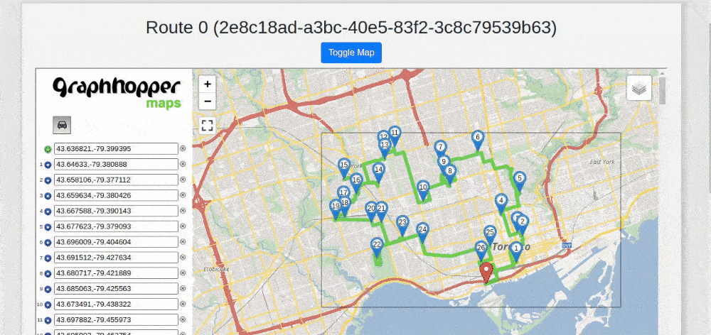

# Logistic Planning - PoC
## Route Optimization


This PoC demonstrates how software could be used for managing and planning real-world logistic challenges. \
This application calculates the shortest (and more cost-effective) route for a vehicle given a starting point (distribution center) and a set of delivery points.

### Tech stack
- Node.js 
- Java
- React.js
- Docker
- Redis

### Frameworks
- [Moleculer](https://moleculer.services/) \
  A microservice framework for Node.js
- [Spring-boot](https://spring.io/projects/spring-boot) \
  An application framework for Java

### Key third-party dependencies
- [Google OR-Tools](https://developers.google.com/optimization) \
  Software toolset for combinatorial optimization problems
- [Graph Hopper](https://github.com/graphhopper/graphhopper) \
  Open source routing engine (used for directions and route visualization in this app)

## Execution
### Via Docker Compose
``` $ bash run-docker-compose.sh ```
### Usage
``` http://localhost:3000 ```